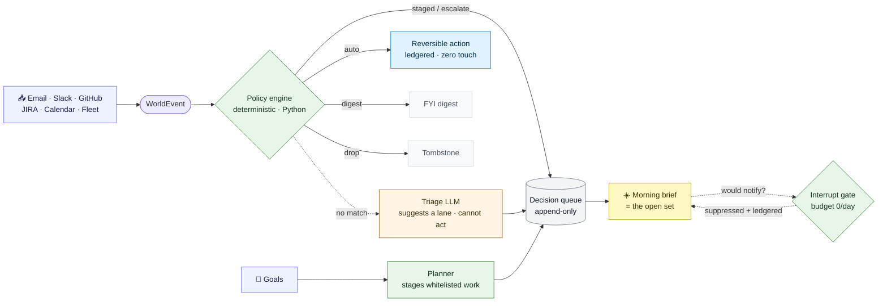

<div align="center">

# 🛰️ Assistant

### Your AI chief of staff for a fleet of Claude Code agents

**Python owns every gate and every send. The LLM only ever *suggests* and *drafts*. Push is silent by construction, and it learns your rules as you work — driving down the one number that matters: _decisions you have to make each morning._**

<p>
  <a href="#install">Install</a> ·
  <a href="#how-it-works">How it works</a> ·
  <a href="#setup--connect-your-sources-opt-in">Connect your sources</a> ·
  <a href="#using-it-day-to-day">The dashboard</a> ·
  <a href="#architecture-decisions-the-why-not-the-what">Design principles</a>
</p>


</div>

---

## Install

```bash
# repo-access engineers: clone over your own SSH identity, then run the installer
ASSISTANT_REPO_URL=git@github.com:elitecoder/assistant.git \
  bash <(curl -fsSL https://raw.githubusercontent.com/elitecoder/assistant/main/install-bootstrap.sh)
```

Prerequisites: `git`, `python3` (3.11+), and the [`claude` CLI](https://claude.ai/code); `cmux.app` for the workspace-driving features. The bootstrap clones to `~/dev/assistant`, runs a **preflight** (`bin/assistant-doctor.py`), wires symlinks, and renders the LaunchAgent plists. `install.sh --apply` **(re)loads the always-on set** (pulse orchestrator + dashboard/todo/watcher daemons); the **opt-in** features (cmux-watcher, Slack comms, slack-reactor) are copied but not loaded — you enable those by hand. It ends by printing the activation runbook.

**→ Full step-by-step onboarding, incl. Slack comms: [ONBOARDING.md](ONBOARDING.md).** Run `./bin/assistant-doctor.py` anytime for a health check.

## What it is

Spin up a dozen Claude Code agents in parallel and walk away. Assistant watches them while you're gone — merging PRs, cleaning up finished work, nudging stalled agents — and surfaces what needs your attention on its dashboard.

The longer you use it, the smarter it gets. It reads your own session history to find patterns, turns corrections and confirmations into rules, and asks if you want to keep them. Confirmed rules sync across all your machines automatically.

## Why it's different

- **Deterministic where it counts.** A Python policy engine — not a prompt — decides every lane, gate, and send. Bugs are diffs and unit tests; behavior can't drift because a model "decided" to do something else.
- **The LLM can't act, only advise.** The triage model's lane map has no `auto` key, and the Strategist drafts *text* but never an action class. Structural guarantees, tested — not guidelines.
- **Silent by construction.** The push budget is 0/day behind a single chokepoint; a suppressed alert is *ledgered*, not delivered. You pull when you want to; it never nags.
- **Draft-only to the outside world.** `email.send` / `slack.send` are registered `forbidden`, not merely absent — enabling one would require a schema change, a new gate, and its own eval.
- **It learns your rules.** Corrections and confirmations from your own sessions become proposed rules you approve, then sync across your machines.

## How it works

Everything inbound — email, a Slack mention, a GitHub notification, a JIRA change, a calendar reminder, a fleet signal, a stalled goal — is normalized into one **WorldEvent** and run through a single deterministic pipeline. The open set of the decision queue *is* your morning brief.



The five lanes, assigned first-match-wins in pure Python (`policy.py` + `config/policies.bootstrap.json`):

- **`auto`** — a pre-declared *reversible* action via existing channels; ledgered, zero human touch.
- **`staged`** — opens a decision for review, with a draft context pack.
- **`escalate`** — opens a decision, queued to the top; the interrupt gate is consulted.
- **`digest`** — a daily FYI, collapsed by source.
- **`drop`** — explicit rule only, ledgered as a tombstone.

Anything the rules don't match falls through to a **suggestion-only triage LLM** whose lane map has no `auto` key — it structurally cannot act, only suggest a lane (any ambiguity or parse failure escalates). Laned items land in an append-only decision queue (`~/.assistant/decisions/decisions.jsonl`).

Two things sit alongside it:

- **Goals are a control loop.** A deterministic planner (`bin/plan-next-actions.py`) detects stalled goals mechanically and stages playbook-whitelisted, reversible work (research, doc drafts, PR scaffolds, test backfill) through the *existing* capped TODO dispatcher — so progress doesn't wait on you opening a dashboard. Whitelist only; anything outside it becomes a staged decision instead.
- **Push is silent by construction.** The noise budget defaults to **0/day** behind a single chokepoint (`bin/interrupt-gate.py`); a suppressed page is *ledgered*, not delivered. Outbound to the outside world is **draft-only** in this tree (`email.send` / `slack.send` are registered `forbidden`, not merely absent).

The whole thing optimizes one number downward, computed mechanically each day: **decisions required per morning**. LLMs only ever suggest or draft — Python owns every lane, gate, and send.

## What it can do

**📥 Capture work from a Slack emoji.** React to any Slack thread with this machine's emoji (`TODO_EMOJI`, default `mukuls2`) and the whole thread — every message, plus a link back — is captured as a TODO in `~/.claude/assistant-todo.json`, the same store the `/todo` skill, the pulse, and the dashboard read. Per-machine emoji routing means a shared bot can fan reactions out to whichever laptop owns that emoji. See [`slack-reactor/`](slack-reactor/README.md).

**💬 Talk to Assistant over Slack.** The opt-in comms daemon (`bin/comms-listen.py`) posts to a private channel you create and invite the bot to: it pings you when Assistant takes a verified action, the instant a workspace needs input or finishes, and when Assistant's heartbeat goes stale — and lets you *reply*. A warm cmux Claude session answers your questions about the fleet in seconds, grounded in real state, and can add a lesson / restart / respawn Assistant on your confirmation. A **mechanical send-gate** confines the bot to that one channel — it can post nowhere else. See [`docs/assistant-comms-onboarding.md`](docs/assistant-comms-onboarding.md).

**🚀 Dispatch TODOs while keeping the fleet from overloading.** A TODO flagged `autoDispatch=true` that's never been spawned gets picked up by the next pulse and dropped into a *fresh* cmux workspace — prompt staged on disk, delivered to the surface, confirmed by watching the transcript grow. Load is bounded by hard caps: at most `ACTIVE_WS_CAP=5` busy workspaces, `TOTAL_WS_CAP=30` total, and `MAX_DISPATCH_PER_PULSE=2` new spawns per cycle. Hit a cap and dispatch waits — the fleet never runs away from you.

**🧠 Turn corrections into rules, then into memory.** `lesson-extractor.py` scans your recent Claude Code transcripts and the action ledger for corrections, confirmations, and recurring questions, and distills lesson candidates into a proposals queue for you to review. Confirm one and it's routed to the right store (one of `claude` / `assistant` / `ffp` / `archffp` / `assistant-repo`), then mirrored into the Obsidian vault and synced to the cross-machine memory repo that feeds Mem0 semantic memory. Nothing is added without your confirmation.

**👋 Nudge stalled work and move the safe stuff forward.** Each pulse the Observer emits one verdict per workspace, and Python — not the model — turns it into an action. `ready_for_merge` queues `/merge-when-ready`; `ready_for_cleanup` sends `/cleanup` (only on workspaces *it* queued the merge for, and only once a work receipt exists); `stranded` nudges the idle agent with what failed and a retry; `needs_user` surfaces an awaiting card and does nothing else. Autonomy is fenced by a back-off list, the work-receipt gate, the assistant-merge ledger, and `NO_INGEST_GUARD`.

## Setup — connect your sources (opt-in)

Connectors are **optional, read-only KeepAlive daemons**. Each turns one source into WorldEvents and nothing more — it never sends, replies, merges, or mutates (a grep CI test enforces this). An unconfigured connector is a quiet `not_configured` — shown as **Available, not connected** on the dashboard's Connections tab, never an error. Connect only the ones you want.

`install.sh --apply` **copies** every connector plist into `~/Library/LaunchAgents/` but never loads one (auto-starting a network daemon behind your back is forbidden — and the pulse self-update re-runs install.sh). So the last step for any connector is a manual `launchctl load`.

<details>
<summary><b>▸ Connector-by-connector setup</b> — GitHub · Gmail · Calendar · Outlook · JIRA · Slack</summary>
<br>

**GitHub notifications** — uses the `gh` CLI's own token:
```bash
gh auth login          # if not already logged in
launchctl load ~/Library/LaunchAgents/com.assistant.connector-github.plist
```

**Gmail** (read-only) — one-time Google Cloud OAuth (your own Google account):
1. Google Cloud Console → enable the Gmail API for a project → create an OAuth client of type **Desktop app** → download its client-secrets JSON (the `{"installed": …}` file).
2. Seed the token cache (opens the Google consent screen — the URL is also printed for headless use; approve the read-only scope), then load the daemon:
```bash
bin/connectors/gmail.py --authorize --client-secrets /path/to/client_secret.json
launchctl load ~/Library/LaunchAgents/com.assistant.connector-gmail.plist
```
The refresh token is stored `0600` at `~/.assistant/connectors/gmail/token.json` and refreshed in-process. Re-run with `--force` to replace an existing cache.

**Google Calendar** (read-only) — the SAME Google Desktop OAuth client as Gmail; emits `event_upcoming` reminders at T-24h and T-1h:
```bash
bin/connectors/gcal.py --authorize --client-secrets /path/to/client_secret.json
launchctl load ~/Library/LaunchAgents/com.assistant.connector-gcal.plist
```

**Outlook / Microsoft 365** (read-only) — one-time Azure app registration (your own Azure/M365 tenant):
1. Azure Portal → register an app under **Mobile and desktop applications** (a **public** client — create NO client secret), redirect URI **`http://localhost`** (not `127.0.0.1` — AAD's loopback exception is scoped to `localhost`), "Allow public client flows" **ON**. Scopes: `Mail.Read`, `User.Read`, `offline_access`. The client-secrets JSON needs only `client_id`.
2. Seed and load (re-run with `--force` if you previously authorized a narrower scope set):
```bash
bin/connectors/outlook.py --authorize --client-secrets /path/to/azure_client.json
launchctl load ~/Library/LaunchAgents/com.assistant.connector-outlook.plist
```

**JIRA** (read-only) — three env vars in `~/.zprofile` (the launcher sources it, so the token never lands in a plist):
```bash
export JIRA_BASE_URL=https://your-org.atlassian.net   # must be https://
export JIRA_EMAIL=you@example.com                     # for JIRA Cloud basic auth
export JIRA_API_TOKEN=…                                # Atlassian API token / PAT
# optional — widen beyond your own issues:
export JIRA_JQL='project = FOO'
launchctl load ~/Library/LaunchAgents/com.assistant.connector-jira.plist
```
Default scope is your own work (`assignee | reporter | watcher = currentUser()`); `JIRA_JQL` overrides/widens the scope clause.

**Slack** (read-only) — rides the existing Bolt app in [`slack-reactor/`](slack-reactor/README.md):
1. Add the connector's two read-only handlers by re-uploading `slack-reactor/slack/manifest.json` to your existing app (api.slack.com/apps), then **reinstall** the app (a scope/event change forces OAuth re-consent — skip it and the connector silently produces nothing).
2. `export SLACK_BOT_TOKEN=xoxb-…` in `~/.zprofile`.
3. Load the daemon:
```bash
launchctl load ~/Library/LaunchAgents/com.assistant.connector-slack.plist
```
Default ingestion is **@-mentions + DMs only**. For full channel/group message ingestion, add `message.channels` / `message.groups` to the manifest AND `export SLACK_INGEST_CHANNELS=1`.

</details>

## Config knobs you own

| Knob | Default | Where | What it does |
|---|---|---|---|
| Noise budget | `page:0, notify:0` (fully silent) | `~/.assistant/noise-budget.json` | Max pushes/day through the interrupt gate. Raising it is a deliberate edit — v1 ships silent by design. |
| Brief wake hour | `7` (local) | `~/.assistant/comms/config.json` → `{"brief":{"wake_hour":N}}` | First pulse at/after this hour builds the day's brief. |
| Planner autoDispatch | **OFF** | `~/.assistant/comms/config.json` → `{"planner":{"autoDispatch":true}}` | OFF (safe default) = a stalled goal *stages a decision* for your review. ON = whitelisted steps dispatch unattended overnight. Flip it on only after watching the planner behave. |
| JIRA scope | your own issues | `JIRA_JQL` env var | Widens the JQL beyond `assignee/reporter/watcher = you`. |
| Slack channel ingest | mentions + DMs only | `SLACK_INGEST_CHANNELS=1` env (+ manifest edit) | Opts into full-channel message ingestion. |
| Connector cadence / caps | 60s · 200 events · 10 pages | `~/.assistant/comms/config.json` → `connectors` block | Per-connector poll cadence and batch caps (module constants are only the fallback). |

**Strategist (M6, the LLM drafter).** In `~/.assistant/comms/config.json` → `{"strategist": {…}}`: `enabled` (default `true`), `dailyCostCeilingUsd` (the day's LLM budget — the Strategist is *shed first* when it's hit, never the Observer), plus per-goal `budget.maxStrategistCallsPerDay` (default `1`) in `assistant-goals.json`. It ships enabled, but on the safe `autoDispatch`-off default it only upgrades *staged-decision* text you review — never unattended work.

## Using it day-to-day

Open the dashboard at **http://127.0.0.1:9876** (localhost only; served by `bin/todo-server.py`).

- **Brief tab** — your morning: open decisions ranked by a deterministic score, each with a one-tap **accept / reject / snooze / edit / wrong-lane** button; plus **handled-overnight** receipts (auto-done actions with their rule id, goal work staged/dispatched with workspace links, verified fleet progress), an **FYI digest** grouped by source, and a **health** row (connector staleness, token expiry, interrupts used/denied, $/day). The dashboard opens **on this tab by default** — the morning brief is the first thing you see.
- **Connections tab** — every connector as **Connected** / **Available, not connected** / **Needs attention**, with the how-to-connect hint inline.
- **`/goal` skill** — add / list / rerank / pause goals (`/goal add "…" --outcome "…"`). Goals feed the planner and boost decision ranking. Automation can only *propose* goal changes; only you (this skill) edit the store in place.
- **One-tap accept** on a decision routes through the todo-server, executes the recommended action class (draft-only for any external send in this tree), and ledgers the transition. Reject / snooze do the same.
- **Nothing pushes or notifies you.** The system is pull-by-design: you go look. Neglected decisions degrade to digest (and mine policy proposals) — they don't nag. A suppressed page is auditable in the brief's health row, never delivered.

## Entry points

- `bin/pulse.py` — the main orchestrator loop, runs every 5 min via LaunchAgent
- `bin/assistant-daemon.py` — the opt-in single-process daemon (`python -m assistant`); runs the decision spine + pulse in one process
- `bin/cmux-watcher.py` — event-driven workspace signal delivery (opt-in LaunchAgent)
- `bin/connectors/*.py` — read-only source connectors (GitHub / Gmail / GCal / JIRA / Slack / Outlook), opt-in KeepAlive daemons
- `bin/build-morning-brief.py` — rebuild today's brief on demand; `bin/plan-next-actions.py` — run the goals planner on demand
- `bin/interrupt-gate.py` — the sole push chokepoint (consulted for every would-be notification)
- `bin/todo-server.py` — the localhost dashboard + JSON API at http://127.0.0.1:9876
- `bin/assistant-curator.py` — lesson/rule management across all five stores
- `bin/tool-dispatch.py` — named tool dispatcher (`bin/tools-manifest.json`)
- `install.sh --apply` — wires everything up; symlinks skills; writes/copies plists (never loads them)

## Architecture decisions (the why, not the what)

**Only one LLM call per pulse.** The Observer's only job is to emit a verdict. Turning a verdict into an action is a Python dictionary. This means bugs are diffs and unit tests, not prompt rewrites — and behavior can't drift because the model decided to do something different.

**PR data comes from `gh`, not from reading the agent's prose.** An earlier version scraped PR numbers from transcript text and auto-closed workspaces based on unrelated merged PRs mentioned in passing. That pipeline is gone. `gh pr view --head <branch>` from cwd only.

**A wrong transcript is worse than none.** `build-ws-context.py` attaches `transcript_path` only when verified to belong to the workspace's live agent. No verified signal → `transcript_path: null`. The Observer judges from the live terminal screen rather than guess from a mismatched transcript.

**Project-scoped lessons belong in project repos, not CLAUDE.md.** A lesson about FFP/Squirrel loading into every unrelated coding session is noise. `assistant-curator.py` routes by `--target` (claude / assistant / ffp / archffp / assistant-repo) and auto-commits project stores to their repo's `.claude/rules/`.

**Memory is layered.** Lessons (rules → CLAUDE.md or project stores), semantic memory (Mem0 at `~/.assistant/mem0/`), human-readable notes (Obsidian vault at `~/dev/obs-elitecoder/Assistant/`), and cross-machine sync (private `mukul-memory` repo). Each layer has a different audience: the LLM, the agent doing semantic search, the human browsing notes.

**Patterns learn from feedback.** The cmux-watcher pattern bank (`~/.assistant/pattern_bank.json`) hot-reloads on file change. Patterns that generate noise from user corrections get downgraded to `muted` automatically via `bin/tools/pattern-feedback.py`.

## Absolute constraints

These are structural, not just conventions — violating them will cause real problems:

- **Never close a cmux workspace.** The orchestrator sends slash commands into workspaces; it never reaches in and closes them. That's the user's call. `/cleanup` is additionally gated on a work receipt existing.
- **Never `launchctl load` automatically.** `install.sh` writes plists but never loads them. The cmux-watcher and single-process daemon plists are opt-in and always loaded by hand.
- **Never widen your own permissions.** Self-improvement edits stay within `~/dev/assistant`, never `~/.claude` global rules. `/update-config` from an agent is blocked.
- **Never trust the header port for archffp teardown.** When two archffp worktrees run concurrently, vite falls back to PORT+1 but the header still shows the original port. Always reconcile against the real listening PID before killing anything.

## Gotchas

- **Self-update refuses a dirty or ahead tree.** `self_update.py` does `git pull --ff-only` only. A dirty tree is surfaced, never steamrolled.
- **NO_INGEST_GUARD:** if the last send to a workspace returned `transcript_size_delta=0` (cmux sent OK but no Claude process was reading), the orchestrator skips the next resend. This breaks the cleanup-resend-loop class of bug structurally.
- **The single-process daemon (`src/assistant/`) is opt-in.** The legacy pulse LaunchAgent keeps running until you explicitly switch over.
- **mem0ai requires Python 3.12.** It lives in `.venv-mem0`; `ensure_venv()` transparently re-execs tools into that interpreter.

## Milestone map (Keel)

| M | What | Status |
|---|---|---|
| M0 | Metering — token/cost capture on every `claude --print` (`bin/metering.py`) | merged |
| M1 | Event spine — typed WorldEvent inbox consumer (`src/assistant/eventspine.py`) | merged |
| M2 | Policy engine + decision queue + suggestion-only triage (`policy.py`, `decisions.py`, `triage.py`) | merged |
| M3 | Morning brief + interrupt gate (`brief.py`, `bin/interrupt-gate.py`; noise budget 0/day) | merged |
| M4 | Goals + deterministic planner (`goals.py`, `bin/plan-next-actions.py`, the `/goal` skill) | merged |
| M5 | Connectors — GitHub, Gmail, GCal, JIRA, Slack, Outlook (opt-in, read-only) | merged |
| M6 | Strategist — throttled LLM drafter for staged goal steps (`src/assistant/strategist.py`) | merged |

## Testing

```bash
python3 -m pytest tests/ -q              # 48 test files, no LLM
cd evals/observer && ./run.py            # 14 real-transcript fixtures × Observer
```

The headline eval fixture (`01-ws97-trap-no-pr-mid-audit`) replays the production bug where an unrelated merged PR in transcript prose drove an auto-close. Run the evals after any change to `prompts/observer-batch-prompt.md` or `bin/build-ws-context.py`.

## Changes

Release notes live in [CHANGELOG.md](CHANGELOG.md) (Keep a Changelog / SemVer). Current: **0.3.1**.

<div align="center">
<sub>A deterministic decision spine over a fleet of Claude Code agents · Python owns every gate · macOS</sub>
</div>
